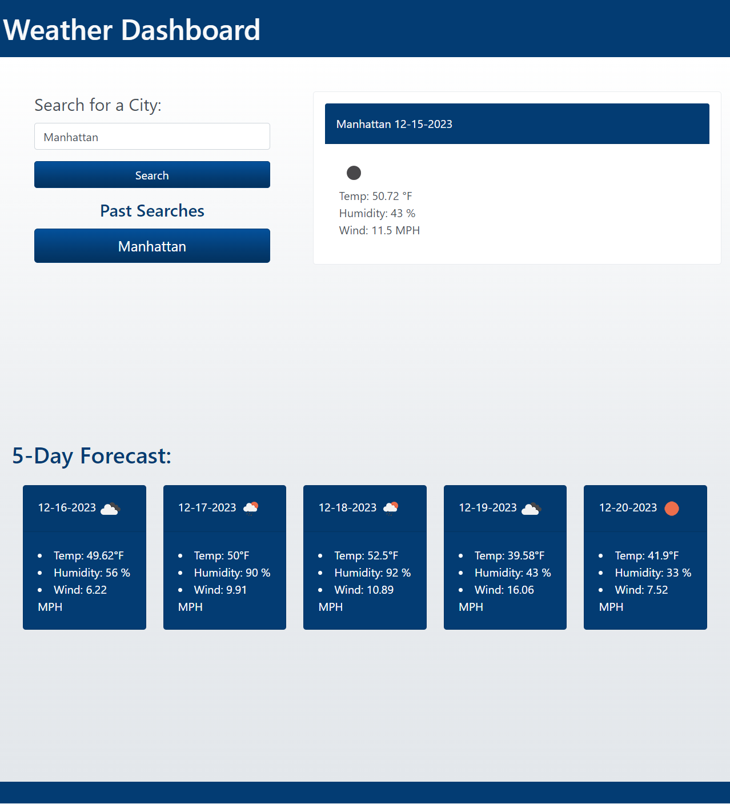

# weather-dashboard
## Description
The goal of this application is to create an interactive Weather Forecast Dashboard. This application utilizes HTML, DayJS, Javascript, Bootstrap CSS, local storage, and server-side APIs to achieve the following requirements: 

- A dashboard that displays the search engine after loading
- Previous searched history will be displayed and stored via local storage.
- A main card that presents user with the city they are searching, the current date, a list of weather conditions with a matching icon
- Five cards represent future weather conditions that display a forecast including the date, weather conditions, and icon
## Deployed Application

### URL
[Weather Dashboard](https://dong135790.github.io/weather-forecast-dashboard/)

### Screenshot

## Usage
- To enter a city name, click on the text input field and type in valid city name
- To search for city, click search button below input field
- To search for a city in your past searches, click on the corresponding button with the city name

## Resources

[Bootswatch Theme Cerulean](https://bootswatch.com/cerulean/)

[Open Weather Map Current Weather Data API](https://openweathermap.org/current)

[Open Weather Map Forecast API](https://openweathermap.org/forecast5)