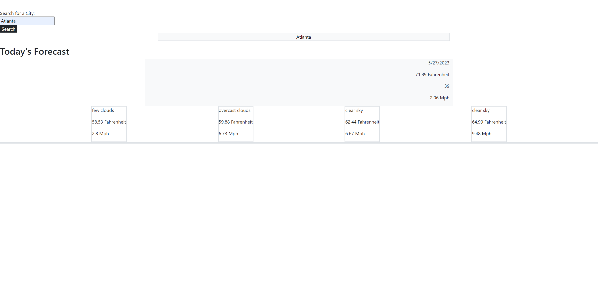

#  Weather Dashboard

## Description 

    A simple weather web browser that displays the current date and weather for the corresponding city that was inputed into the field. All inputed text will be converted to 'word', so each first letter of each word will be capitalized to prevent errors. 

## Badges

NA

## Visuals

## Installation

NA 
## Usage

    Weather forecast dashboard currently displays the current date and includes temperature (in fahrenheit), humidit, and wind in mph.
## Roadmap

    Implement icons so there can be visual representations of the weather at the time. 
## Contributing

Not currently open to contributions at this time.

## Authors and acknowledgement

Justin Dong
## License

NA

## Resources

[Github Repository](https://github.com/dong135790/weather-forecast-dashboard)
[Deployed Site](https://dong135790.github.io/weather-forecast-dashboard/)

## Project Status

~~~~